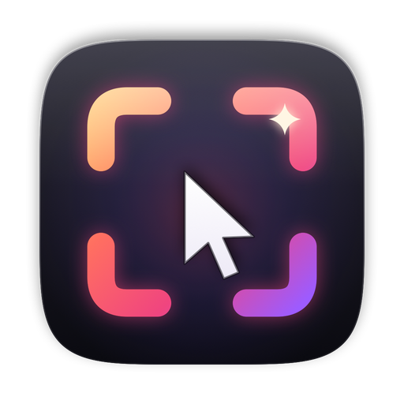
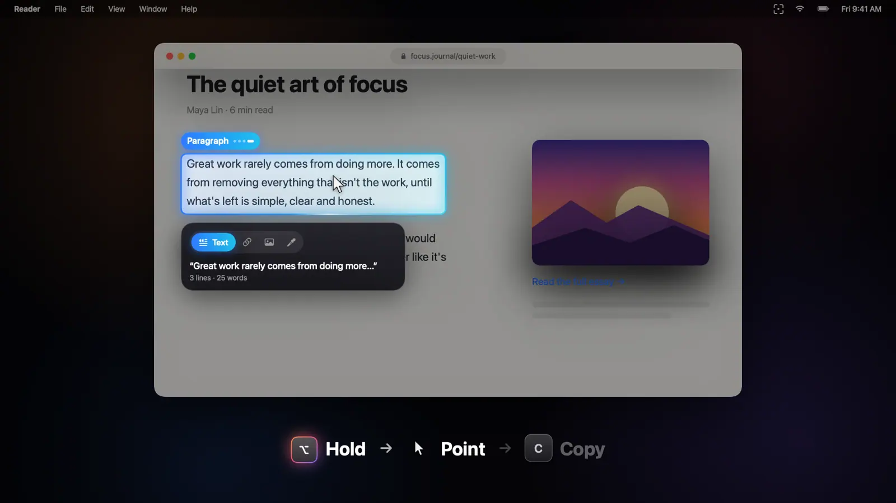
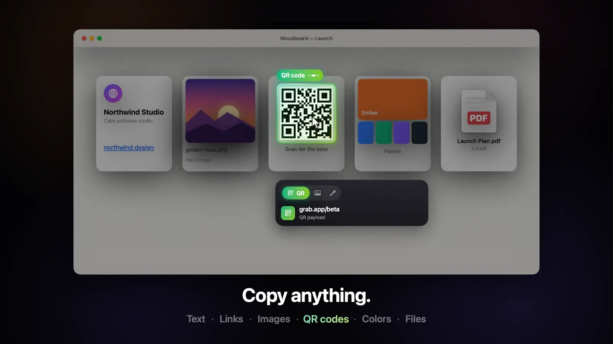
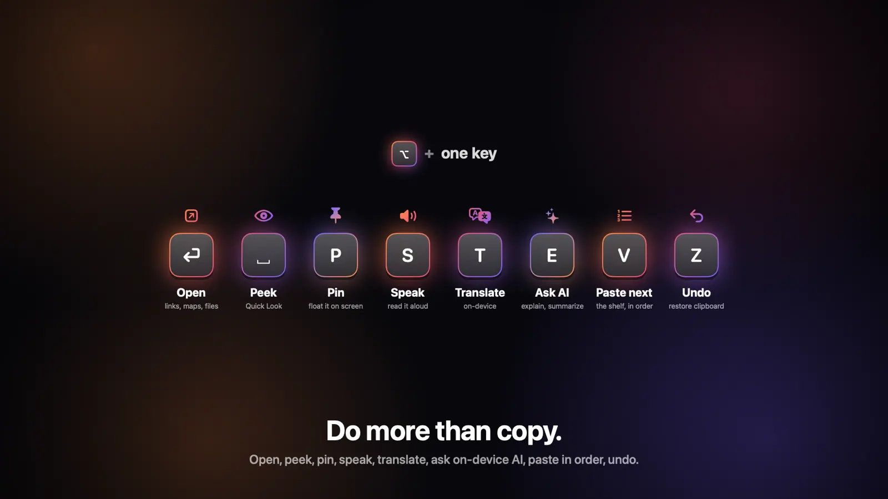
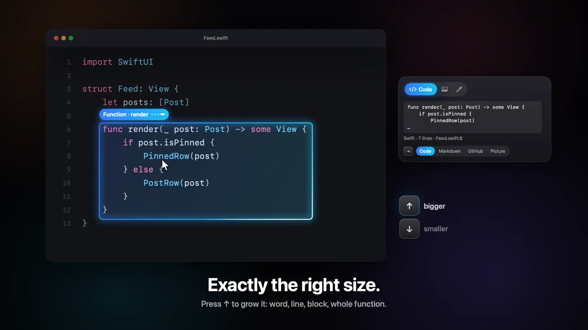
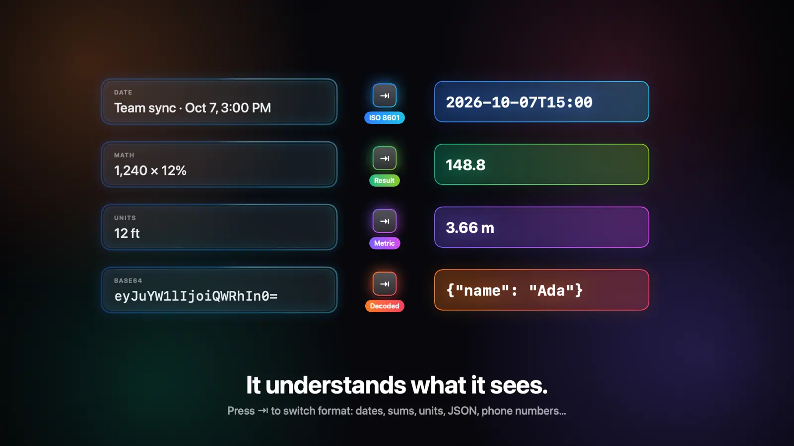

<p align="center">
  
</p>

<h1 align="center">Grab</h1>

<p align="center">
  <strong>Copy anything on your Mac by pointing at it.</strong><br>
  Hold <kbd>⌥</kbd>, hover, press <kbd>C</kbd>. Text, links, images, QR codes, colors, files, code and tables.
</p>

<p align="center">
  
  
  
  
  
</p>

<p align="center">
  <a href="#point-copy-done">Features</a> ·
  <a href="#keys">Keys</a> ·
  <a href="#beyond-copy">Beyond copy</a> ·
  <a href="#smart-formats">Smart formats</a> ·
  <a href="#privacy">Privacy</a> ·
  <a href="#install">Install</a> ·
  <a href="#how-its-built">How it's built</a>
</p>

<br>

<p align="center">
  
</p>

<p align="center"><b>▶ Watch it with sound</b></p>

https://github.com/user-attachments/assets/cf548335-4d6b-4f8b-b58c-722a6e0102b7

<p align="center">
  <sub>30 seconds · original soundtrack (unmute in the player) · every frame and every sound generated by code · <a href="promo/Grab-promo.mp4">1080p60 master</a></sub>
</p>

<br>

<table>
  <tr>
    <td width="33%" valign="top">
      <h3>👆 Point, don't select</h3>
      No dragging rectangles, no selecting text, no right-clicking. A glowing border shows exactly what you're about to grab.
    </td>
    <td width="33%" valign="top">
      <h3>🧠 Understands what it sees</h3>
      Dates, prices, JSON, stack traces, code structure, tables. <kbd>⇥</kbd> gives you the format you actually need.
    </td>
    <td width="33%" valign="top">
      <h3>🔒 Private by design</h3>
      OCR, translation and AI run on your Mac. Secrets are hidden from clipboard managers and history stays in memory.
    </td>
  </tr>
</table>

## Point. Copy. Done.



Hold <kbd>⌥</kbd>, hover, press <kbd>C</kbd>. A small HUD shows what kind of thing is under the cursor and exactly what will land on your clipboard. Release <kbd>⌥</kbd> and everything disappears.



| Point at… | You get… |
|---|---|
| Text (any app, any web page) | The paragraph, line, sentence or word |
| A link | Its URL |
| An image | The image (the original file for web images, otherwise pixel-perfect) |
| A QR code / barcode | The decoded value |
| A color | `#ED6E2A` (or RGB / HSL / SwiftUI, your choice) |
| A file in Finder | The file itself (paste into Finder, Mail, Slack…) or its path |
| Text inside an image, video, canvas or game | The recognized text (on-device OCR) |
| Code | A symbol, expression, string, line, statement, `if`/`for` block, **function**, class or the whole file |
| A table | A cell, row, **column** or the whole table (pastes into spreadsheets as cells), even a table inside a screenshot |
| A list, menu or dropdown | Every item, as lines, bullets, numbers, comma-separated or a JSON array |
| A form | Every field as JSON (password fields skipped) |
| A photo | The image, just its **subject** (background removed), its color palette or a data URI |
| A Wi-Fi QR code | The password or network name |
| A command in a terminal | The command without the prompt, or its output |
| A box you draw (<kbd>R</kbd>) | Everything inside: its text, a picture of it, a QR code or a table in it |

Grab picks a smart default for whatever is under the cursor (a link gives Link, a photo gives Image, a QR code gives its value, a plain colored area gives Color) and remembers your <kbd>←</kbd> <kbd>→</kbd> choice for the rest of that hold.

## Keys

While holding <kbd>⌥</kbd> (or the key you pick in Settings: right <kbd>⌥</kbd> only, <kbd>⌃</kbd><kbd>⌥</kbd> or Hyper):

| Key | Does |
|---|---|
| <kbd>C</kbd> | **Copy** |
| <kbd>←</kbd> <kbd>→</kbd> | Switch type: Text · Link · QR · File · Image · Color |
| <kbd>↑</kbd> <kbd>↓</kbd> | Grow / shrink the area: word → line → sentence → paragraph → block → window (in code: symbol → line → block → function → class → file) |
| <kbd>⇥</kbd> | Switch format (see [Smart formats](#smart-formats)) |
| <kbd>⇧</kbd> <kbd>C</kbd> | Add it to the **shelf**, a floating list you can reorder; the clipboard always holds the whole shelf |
| <kbd>V</kbd> | **Paste the next** shelf item into whatever has focus, one at a time, in order (it goes in as you let go of <kbd>⌥</kbd>) |
| <kbd>R</kbd> | Draw a **box** from here: move to size it, <kbd>C</kbd> copies everything inside, <kbd>R</kbd> again goes back to pointing |
| <kbd>D</kbd> | **Compare** it with what's on the clipboard, word by word or line by line |
| <kbd>F</kbd> | **Fill** the form under the pointer from your clipboard (a form copied with <kbd>⇥</kbd> Fields, or `Name: Ada` lines) |
| <kbd>⏎</kbd> | **Open** it: links, files, Maps for addresses, Calendar for dates, FaceTime for phone numbers, the tracking page for parcels, a web search for anything else |
| <kbd>Space</kbd> | **Peek** with Quick Look |
| <kbd>P</kbd> | **Pin** it on screen in a small floating window (text stays selectable) |
| <kbd>S</kbd> | **Speak** it (again to stop) |
| <kbd>T</kbd> | **Translate** it, on-device |
| <kbd>E</kbd> | **Ask** on-device AI: explain, summarize, fix OCR'd text, turn it into JSON, or ask your own question |
| <kbd>Z</kbd> | **Undo** the last grab and restore what was on the clipboard |
| <kbd>Esc</kbd> | Cancel |



## Exactly the right size



Point at code anywhere and Grab understands its structure.

- **Point at a function's signature** and you get the whole function, with its doc comment and attributes. Point inside and you get the line; <kbd>↑</kbd> walks out through the `if`/`for` block, the function, the class and the file, <kbd>↓</kbd> goes back in to the expression and symbol.
- Copied blocks are **dedented**, so they paste cleanly. <kbd>⇥</kbd> switches to a fenced Markdown block, a `path:line` reference or a **GitHub / GitLab permalink** to those exact lines.
- Works in **Xcode** and other native editors, **Terminal / iTerm**, **VS Code**, **Cursor** and other VS Code forks, code blocks on web pages (GitHub, docs, AI chat answers) in **Safari, Chrome** and Electron apps, and even code in screenshots and videos.
- Understands brace languages (Swift, JS/TS, Go, Rust, C/C++/ObjC, Java/Kotlin, C#, PHP, CSS…), indentation languages (Python, YAML) and `end` languages (Ruby, Lua, Elixir).
- **Terminals:** hover a prompt line for the command (prompt stripped), output lines for the output block, a path for the file itself (`Sources/App.swift:12:4` included).
- **Paste-aware:** code you copy adapts when you paste it. No `$` prompts in a terminal; a fenced code block in Slack, Discord, Notion or Obsidian.

<details>
<summary><b>How it reads code from editors that don't expose it</b></summary>
<br>

Native editors and Safari report exact character positions. VS Code-style editors draw text without exposing it, so Grab reads the open file from disk (or finds it with Spotlight from the tab name), OCRs the screen once and aligns the two using the line numbers in the gutter. What you copy is the real file content, not OCR. It never turns on screen-reader modes in your editor.

</details>

## Beyond copy

| | |
|---|---|
| **Draw a box** | <kbd>⌥</kbd><kbd>R</kbd> at one corner, move to the other. Grab reads everything inside, even text in a canvas, video or a remote screen, and offers the picture, any QR code in it and any table in it. |
| **Paste queue** | Collect things with <kbd>⌥</kbd><kbd>⇧</kbd><kbd>C</kbd>, then fill a form field by field with <kbd>⌥</kbd><kbd>V</kbd>: each press pastes the next item. The shelf marks which one is next. |
| **Compare** | Copy one version, point at the other, <kbd>⌥</kbd><kbd>D</kbd>. A panel shows what changed, and copies the difference as a patch. |
| **Fill forms** | Copy a whole form as JSON with <kbd>⇥</kbd> Fields, point at another form, <kbd>⌥</kbd><kbd>F</kbd>. Fields are matched by their labels ("E-mail" fills "Email address", "Zip" fills "Postal code"). Password fields are skipped. |
| **Live pins** | Pin a picture or text read from the screen (<kbd>P</kbd>) and switch it to **Live**: it re-checks that spot every few seconds and flashes when it changes. Handy for a build status, a price or a progress bar. |
| **Your own formats** | Add templates to the <kbd>⇥</kbd> list, like `[{title}]({url})` or `{date}: {text\|oneline}`, or run any Shortcut on the grab and copy what it returns. |
| **Code as a picture** | <kbd>⇥</kbd> Picture turns code into a syntax-colored card, ready to paste into Slack or a post. |

## Smart formats



<kbd>⇥</kbd> offers formats for whatever Grab recognizes and remembers your choice for each kind. The HUD previews exactly what will be copied.

| Recognizes | Formats |
|---|---|
| **Dates & times** | ISO 8601 · your local time · Unix time · an `.ics` calendar event titled from the surrounding text |
| **Phone numbers** | `+15551234567` (your region fills in the country code) · digits · a `tel:` link |
| **Emails & addresses** | The bare address · `mailto:` · one line · Apple Maps · Google Maps |
| **Prices** | The plain number · converted to your currency (ECB daily rates) |
| **Measurements** | Metric ⇄ imperial: `12 ft` → `3.66 m`, `72°F` → `22.2°C` |
| **Tracking numbers, flights, ISBNs, DOIs** | The clean number · the right tracking or lookup page |
| **JSON · JWT · base64 · timestamps · sums** | Pretty / minified (key order kept) · decoded payload · readable date · `1,240 × 12%` → `148.8` |
| **Stack traces & errors** | The error line · a search link · the trace with library frames folded away |
| **Text** | One line · quote · **cite** (with page title and URL) · font name, size and color (CSS in browsers) · CSS selector |
| **Links** | URL · Markdown · title · YouTube **at the current time** (`youtu.be/…?t=93`) |
| **Images** | Image · **subject only** · color palette · data URI |
| **Files** | File · path · name · app icon at 1024 px |
| **Code** | Code · Markdown · `path:line` · permalink · **Picture** |
| **Anything** | Your own templates (`{text}`, `{url}`, `{title}`, `{app}`, `{date}`… with filters like `\|upper` and `\|slug`) and Shortcuts |

## Mascots

Every grab gets carried up to the menu bar, by a mascot of your choice (Settings → Feel → Mascot):

| | |
|---|---|
| **Snap** (default) | A jelly critter in Grab's colors whose hands are the logo's viewfinder corners. The border around your grab *becomes* its hands: they clamp the thing into a little card and Snap hops it up to the menu bar. |
| **Clawsy** | An arcade claw machine: rides along the top of the screen, drops on its cable, clamps, lifts, slides home. |
| **Beamy** | A tiny saucer that abducts your copy with a tractor beam. |
| **Ribbit** | A frog in the menu bar with a very sticky tongue. Gulp. |
| **Classic** · **Off** | The original flying chip, or nothing at all. |

Each has its own little sounds, the menu bar icon lights up the moment the grab lands, and Reduce Motion turns them off. They strain under a big image or a long text, pop up by the pointer with a "?" when a grab doesn't work out, and dress up for Halloween and the winter holidays (Settings → Seasonal outfits).

## Privacy

- **Secrets stay secret.** API keys, tokens, private keys and Wi-Fi passwords are marked concealed (clipboard managers skip them), kept out of history, and cleared from the clipboard after a minute.
- **Password fields are never read.** In native apps and in browsers.
- **Nothing is kept on disk** unless you ask. History and the shelf live in memory; files made for dragging or Quick Look are temporary. *Keep history after quitting* (off by default) saves history encrypted with AES-GCM, with the key in your keychain, readable only by you, and never with secrets in it.
- **On-device.** OCR, barcode detection, translation and AI (Apple Intelligence) run on your Mac. See below for the only times Grab goes online.
- **Never in your captures.** The overlay is hidden from screenshots and screen recordings by default.

### Permissions, explained

| | What it's for | When it's used | What Grab never does | Without it |
|---|---|---|---|---|
| **Accessibility** (required) | Noticing ⌥ and C, and reading what's under your pointer: the text, links, files and tables apps already describe to tools like VoiceOver | Modifier keys all the time; other keys and the pointer only while ⌥ is held | Click, move windows or read password fields. It types only when you ask: <kbd>⌥</kbd><kbd>V</kbd> presses ⌘V for you once you let go of ⌥, <kbd>⌥</kbd><kbd>F</kbd> fills a form. Nothing you type is recorded | Grab can't work |
| **Screen Recording** (optional) | Images as they appear, colors, QR codes, and text inside pictures, video and apps that don't describe themselves (on-device OCR) | During a hold, around the pointer, or for a pin you've set to Live; Grab's own overlay is excluded | Record video, upload or keep screenshots | Text, links, files and code still copy; images, colors, QR, OCR, boxes and live pins are off |

No other permissions. Grab goes online only to check GitHub for a new version about once a day, for currency exchange rates (only currency codes are sent), and, when you copy a web image, to fetch the original from the address your browser already loaded it from. The first two can be turned off. A Shortcut you run from your own format does whatever that Shortcut does.

### Light

- **~15 MB, 0% CPU, zero wakeups when idle.** Grab listens only to modifier keys until you hold ⌥; key presses and the mouse are observed only during a hold. Permission checks stop once both are granted.
- **Vision runs in a helper.** OCR, QR scanning and subject lifting happen in a short-lived `Grab --vision-worker` process that starts when you hold ⌥ and quits after ~25 s idle, so its models' memory goes back to the system. If it ever fails, the work runs in-process.
- **Nothing lingers.** Captures aren't kept after they're read, every cache is dropped when you release ⌥, freed memory is handed back to macOS, and history keeps images compressed. Saved history is read on first use, not at launch.
- **Only what you turn on.** A Live pin wakes Grab every few seconds only while it's live. Update checks are scheduled by macOS for a moment that suits it, so they cost no wakeups of their own.

<details>
<summary><b>Precision and details</b></summary>
<br>

- **Words everywhere.** Safari, Chrome and Electron apps all give word → sentence → line → paragraph, down to a single timestamp, count or username.
- **Sees through overlays.** Sites like Reddit lay invisible links over cards; Grab looks underneath for the text you're actually pointing at, and keeps the card's link one <kbd>←</kbd> <kbd>→</kbd> away.
- **OCR that holds up.** Apple's document recognizer (paragraphs, lines, words, tables) at full resolution around the cursor, with a second focused pass when the first misses a line.
- **QR codes, reliably.** A tight multi-scale scan around the cursor reads codes wherever they are (images, CSS backgrounds, canvases, video), including inverted, colored, logo-in-the-middle and tiny ones.
- **Objects nothing describes.** Pictures, icons and color blocks that apps don't expose are outlined from the pixels: solid blocks become colors, pictures become images.
- **Exact colors.** Sampled through the system's color-managed capture path, so the hex you copy is the hex the page specified, even on P3/HDR displays. A magnifier loupe shows the exact pixel.
- **Gets out of the way.** ⌥-click, ⌥-drag, ⌥⇧ shortcuts and typing with ⌥ behave as before; Grab only activates for a deliberate hold. If you were just typing it waits for the mouse to move, so ⌥← / ⌥→ word-jumping keeps working. Apps where ⌥ means something else can be excluded from the menu bar.
- **Your key.** Hold either ⌥ (default), **right ⌥ only**, ⌃⌥ or a Hyper key. On keyboards that type `@ [ ] { }` with ⌥ (German, French, Nordic…), Grab notices and suggests right ⌥, so left ⌥ stays free for typing.
- **Feel.** Synthesized sounds, trackpad haptics, a spring-animated border with a sweeping sheen, a Liquid Glass HUD and a chip that flies to the menu bar when you copy. Respects Reduce Motion.
- **History, by app.** The menu bar shows recent grabs and a **By App** submenu; **Open History…** (⌘F) has search, type filters (text, links, images, colors, files, QR), grouping by app or by time, and keyboard control (↑ ↓, ⏎ copies, ⌘⌫ removes). Memory only, unless you turn on Keep History.
- **Stats.** Settings counts your grabs and estimates the time they saved (counts only), with a card you can paste anywhere. Milestones get a little celebration.
- **Learn by doing.** The welcome window has a six-step practice: a sentence, a function, a color, a QR code, text in a picture and a box, each ticking off as you grab it.
- **Per-app preferences.** "In Figma, prefer Color", "In Safari, prefer Link", from the menu bar or Settings.
- **Automation.** `grab://copy?mode=text` grabs what's under the pointer (bind it to a key in Shortcuts), plus `grab://history`, `grab://shelf`, `grab://pause`, `resume` and `toggle`.
- **Accessibility.** VoiceOver announces what's targeted and what was copied; *Increase Contrast* gets a thicker, solid border.
- **Secure input.** When another app turns on Secure Keyboard Entry, macOS hides keystrokes from every app, Grab included; the HUD tells you when that's the case.
- **Typing ç.** With *Instant ⌥C* on (default), ⌥C always grabs. If you type ç with ⌥C, turn it off in Settings.

</details>

## Install

**Download:** `Grab-x.y.z.dmg` from GitHub Releases (once releases are public), open it and drag Grab to Applications. Each release also produces a Homebrew cask (`grab.rb`); once it's published to a tap:

```bash
brew install --cask 0x1p0/tap/grab
```

Grab keeps itself up to date: about once a day it checks GitHub for a new release and asks before installing. It only installs an update signed by the same developer as the copy you're running, and your settings and permissions carry over. **Check for Updates…** is in the menu bar.

On first launch Grab asks for two permissions:

- **Accessibility** (required): to see what's under the cursor and hear ⌥C.
- **Screen Recording** (for images, colors, QR codes, OCR, boxes and live pins): macOS asks you to relaunch Grab after you turn it on.

### Build from source

Requires macOS 14 or later (best on macOS 26+) and the Xcode command line tools.

```bash
scripts/build.sh --install --run   # release build, signed, copied to /Applications, launched
scripts/build.sh --debug           # debug build with command-line debug hooks
swift test                         # unit tests
```

`build.sh` signs with your Developer ID or Apple Development certificate if you have one, so macOS remembers Grab's permissions across rebuilds.

### Releasing

```bash
scripts/release.sh 1.2.0
```

builds, signs and packages `dist/Grab-1.2.0.dmg` (to download), `dist/Grab-1.2.0.zip` (what the updater installs) and `dist/grab.rb` (the Homebrew cask). For other people's Macs it needs a **Developer ID Application** certificate (Apple Developer Program) and notarization: save your notary credentials once with `xcrun notarytool store-credentials grab-notary`, then run it with `NOTARY_PROFILE=grab-notary`. Without a Developer ID it signs with your Apple Development certificate and says that build only opens on your own Macs.

On GitHub, every push to `main` builds and runs the tests ([`ci.yml`](.github/workflows/ci.yml)), and pushing a tag like `v1.2.0` builds, signs, notarizes and publishes the release ([`release.yml`](.github/workflows/release.yml)) once the signing secrets listed at the top of that file are set.

## How it's built

<details>
<summary><b>Architecture</b></summary>
<br>

```
Sources/Grab/
  App/        AppDelegate (wiring, permissions, URL scheme, debug hooks), main
  Engine/
    KeyTap            system-wide ⌥ state machine on its own thread
    KeyLayout         which physical keys type c, p, s… in your keyboard layout
    Inspector         accessibility tree → ranked "scopes" (word … window)
    Inspector+Code    code detection for editors, terminals and web code blocks
    Inspector+Extras  lists, form fields, fonts, CSS selectors, video timestamps
    Session           one ⌥ hold: targeting, modes, formats, OCR/QR analysis, copying, actions
    CodeIntel         lexer + structure finder: symbols, statements, blocks, functions, types
    CodeGrid          learns where each line of code sits on screen from OCR + the real text
    SmartData         colors and file paths written in text
    SmartTypes        dates, phones, addresses, prices, units, tracking numbers, JSON,
                      JWT, base64, timestamps, math, stack traces + their formats
    Formats           ⇥-cyclable output formats
    CustomFormats     your own templates ({text}, {url}…) and Shortcuts in the ⇥ list
    CodeImage         syntax-colored code cards for ⇥ Picture
    FormFill          ⌥F: reads form data off the clipboard and matches it to fields by label
    TextDiff          ⌥D: word and line differences, and unified patches
    Keystroke         the one keystroke Grab sends: ⌘V for the paste queue
    ImageTools        subject lifting, palettes, data URIs, icons
    Git               repository → GitHub/GitLab/Bitbucket permalinks (reads .git, never runs git)
    TextReader        OCR (document structure) + QR/barcode scanning
    VisualObjects     finds pictures, icons and swatches from pixels
    ScreenGrabber     ScreenCaptureKit capture
    VisionService     OCR, QR and subject lifting in a short-lived helper process
    Model             scopes, modes, colors, payloads
  Overlay/    per-display click-through windows; border + spotlight on Core Animation
              (springs run in the render server), HUD, loupe and toast in SwiftUI;
              Mascots (choreography, reactions, seasonal outfits)
  UI/         menu bar, onboarding + practice, settings, panels (pins + live pins,
              Ask/translate, compare, shelf, history, updates, Quick Look)
  Support/    settings, permissions, synthesized sounds, clipboard (undo, secrets,
              paste-aware code), history + shelf, HistoryVault (encrypted Keep History),
              Stats, Updater, on-device AI, speech
scripts/      build.sh, release.sh, make_icon.swift, promo/ (the video renderer)
Tests/        code intelligence, smart types, formats, OCR merging, resources, triggers,
              form filling, diffs, templates, updates, the history vault and stats
```

</details>

<details>
<summary><b>The promo video is code too</b></summary>
<br>

[`scripts/promo/GrabPromo.swift`](scripts/promo/GrabPromo.swift) draws all 1,800 frames with SwiftUI from a timeline and synthesizes the soundtrack sample by sample: a chord pad, bass, drums, a plucked arpeggio, and sound effects timed to every snap, key press and copy. ffmpeg encodes it to H.264 at 1080p60.

```bash
scripts/promo/render.sh                    # → promo/Grab-promo.mp4, about two minutes
scripts/promo/render.sh --stills 6.9 17.6  # PNG stills at those seconds
```

</details>

<br>

<p align="center">
  <br>
  <sub>Built by <a href="https://github.com/0x1p0">0x1p0</a></sub>
</p>
